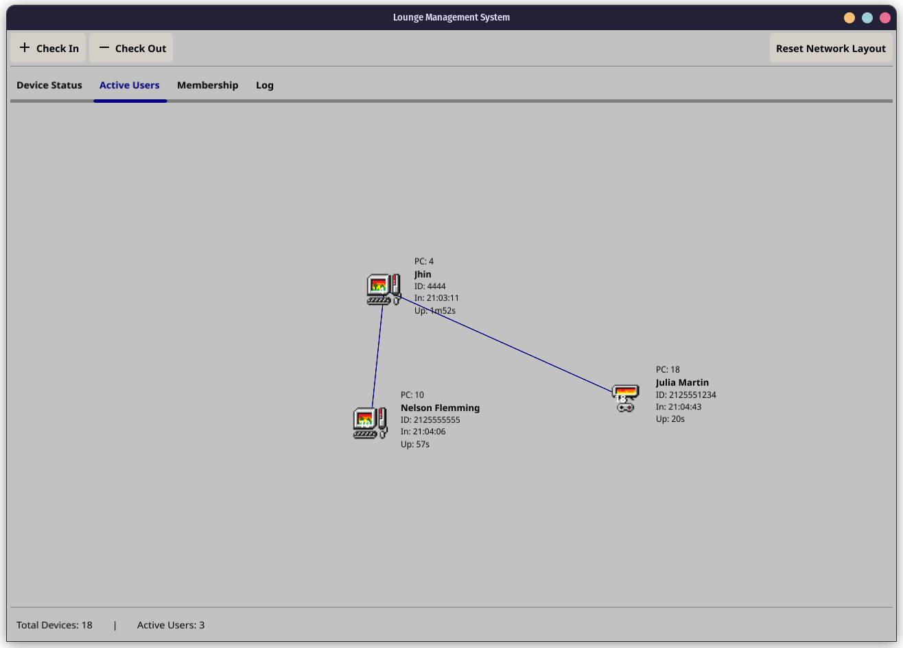

# Lounge Management System

A desktop application for managing gaming lounge operations.

 
 

## Installation

### Option 1: Using Pre-released Packages

Go to the [Releases](https://github.com/odesaur/lounge/releases) page

### Option 2: Compile from Source

#### Build Steps

1. Clone the repository:
   ```bash
   git clone https://github.com/odesaur/lounge.git
   cd lounge
   ```

2. Install dependencies:
   ```bash
   go mod download
   ```

3. Build the application:
   ```bash
   go build -o GamingLounge
   ```

4. Run the application:
   ```bash
   ./GamingLounge
   ```

## Data Storage

- Active user data: Stored in `log/active_users.json`
- Member information: Stored in `membership.csv`
- Daily activity logs: Stored in `log/lounge-YYYY-MM-DD.json`
