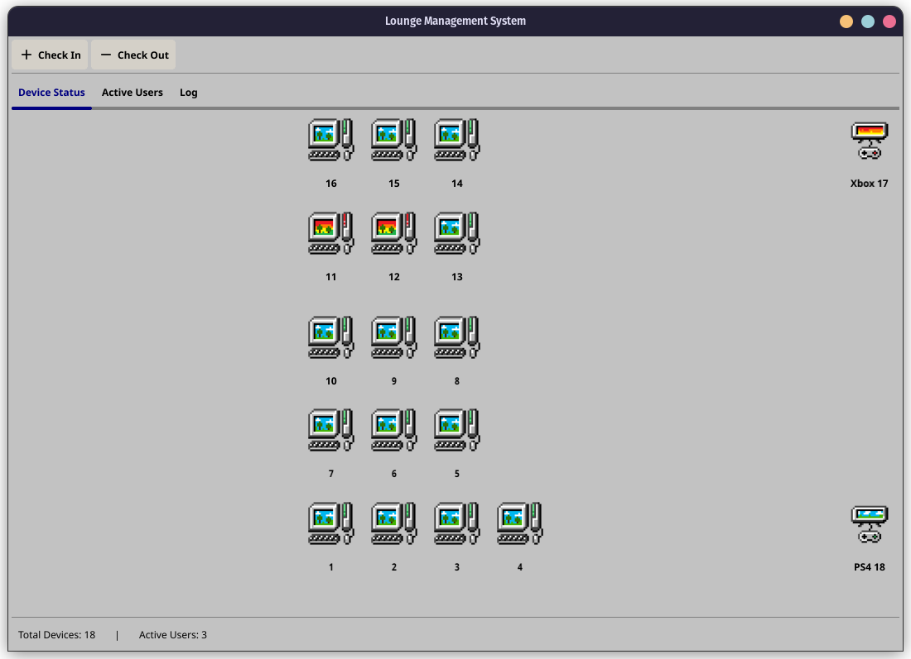

# Lounge Management System

A desktop application for managing gaming lounge operations.

 

## Installation

### Option 1: Using Pre-released Packages

1. Go to the [Releases](https://github.com/odesaur/lounge/releases) page
2. Download the appropriate package for your operating system:
3. Place the file to your desired location
4. **Important:** Check that the `src` directory contains the necessary image files:
5. You can replace these images with your own if desired (keep the same filenames)
6. Run the `GamingLounge` executable

### Option 2: Compile from Source

#### Prerequisites

- Go 1.16 or later
- Fyne dependencies (see [Fyne Getting Started](https://developer.fyne.io/started/))

#### Build Steps

1. Clone the repository:
   ```bash
   git clone https://github.com/odesaur/lounge.git
   cd GamingLounge
   ```
2. Ensure the `src` directory is present with required image files:
3. Replace the image files with your preferred icons if desired (maintaining the same filenames)

4. Install dependencies:
   ```bash
   go mod download
   ```

5. Build the application:
   ```bash
   go build -o GamingLounge
   ```

6. Run the application:
   ```bash
   ./GamingLounge
   ```

## Data Storage

- Active user data: Stored in `log/active_users.json`
- Member information: Stored in `membership.csv`
- Daily activity logs: Stored in `log/lounge-YYYY-MM-DD.json`
